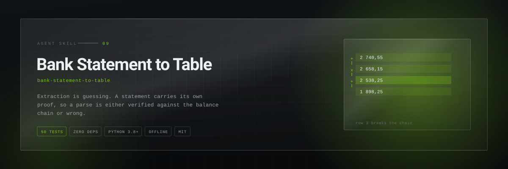
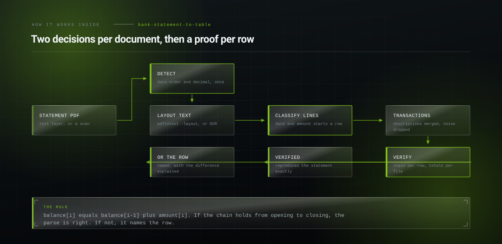

<p align="center">
  <picture>
    <source media="(prefers-color-scheme: dark)" srcset="assets/hero-dark.svg">
    <source media="(prefers-color-scheme: light)" srcset="assets/hero-light.svg">
    
  </picture>
</p>

<h1 align="center">Bank Statement to Table</h1>

<p align="center"><b>Convert a bank statement PDF into a spreadsheet and then prove the extraction is correct against the statement's own running balance. European and Anglo number formats, multi-line descriptions, scans. Entirely offline.</b></p>

<p align="center">
<a href="LICENSE"></a>
  
  
  
  
</p>

<p align="center">
  <code>npx skills add Hiberius/bank-statement-to-table</code>
</p>

<p align="center">
  <sub>Works with Claude Code, Claude Desktop, Codex, Cursor, Windsurf, OpenClaw and
  anything else that reads a <code>SKILL.md</code>.</sub>
</p>

---


## Anyone can extract. The question is whether it is right

Every running balance equals the previous balance plus the movement. That is not a
convention, it is what a balance is. So a parse either reproduces the chain from the
opening balance to the closing balance, or it is wrong and the chain says which row.

```
balance[i] == balance[i-1] + amount[i]      every row
opening + sum(amounts) == closing           the whole statement
```

**Never hand over an extraction that has not passed both.** Extraction is guessing.
Verification is knowing.

## What it does

| Command | What you get |
|---|---|
| `detect` | Date order and decimal separator for this document, and whether there is a text layer at all |
| `parse` | Transactions with date, value date, description, amount and balance, from `pdftotext -layout` output |
| `verify` | The chain row by row and the totals for the file, with the difference explained on the row it names |


## How it works inside

<p align="center">
  <picture>
    <source media="(prefers-color-scheme: dark)" srcset="assets/diagram-dark.svg">
    <source media="(prefers-color-scheme: light)" srcset="assets/diagram-light.svg">
    
  </picture>
</p>


## The proof

```bash
pdftotext -layout statement.pdf - > statement.txt
python3 scripts/statement.py parse  statement.txt --out rows.csv
python3 scripts/statement.py verify rows.csv --opening 1240.55 --closing 2103.11
```

```
rows                7 (7 carry a balance)
chain checks        6
chain breaks        0
sum of movements    862.56
opening + movements 2103.11
stated closing      2103.11
difference          0.00

VERIFIED: the parse reproduces the statement exactly.
```

Change one digit and:

```
NOT VERIFIED: the parse does not reproduce the statement.

  break at row 1, 2026-06-03  PAGAMENTO POS SUPERMERCATO
    2740.55 -8.24 should give 2732.31, the statement says 2658.15 (off by -74.16)
    hint: the difference equals the amount on 2026-06-05: that row is probably
          duplicated or missing
```

## Two decisions made once, never per row

`01/06` is ambiguous and no cleverness resolves a single row: if any date in the file has
a first component above 12, the whole document is day-first. Deciding per row silently
swaps January and October.

`1.234,56` and `1,234.56` are the same number from two different worlds. Deciding per
value turns `1.234` into 1234 on one row and 1.234 on the next, and the totals then miss
by three orders of magnitude.

```bash
python3 scripts/statement.py detect statement.txt
```
```
date order             day-first (dd/mm)
decimal separator      comma (1.234,56)
```

## It handles what real statements do

- **Multi-line descriptions.** A line with a date and an amount starts a transaction; a
  line with neither continues the previous one. Nothing else is a row.
- **Page breaks, repeated column headers, carried-forward lines, opening and closing
  balance lines.** All skipped, and counted so you can see they were.
- **Every negative convention**: `-82,40`, `82,40-`, `(82,40)`, `82.40 DR`.
- **Value date separate from booking date**, kept, because you cannot recover it later.
- **Scans.** `detect` tells you there is no text layer instead of returning an empty table.

## Your statement never leaves your machine

No network calls, no telemetry, no dependencies, by design. A statement carries the
account holder, the IBAN, the balance and a complete map of a person's life by
counterparty.


## Documentation

- [`SKILL.md`](SKILL.md) — the skill itself, what the agent reads
- [`references/extraction.md`](references/extraction.md) — text layer against scan, why -layout, column clustering, year boundaries, Italian vocabulary
- [`references/verification.md`](references/verification.md) — the two checks, difference signatures, tolerance, what to record, privacy


## Related skills

- **[invisible-text-forensics](https://github.com/Hiberius/invisible-text-forensics)** — the other skill built on proving a document is what it looks like
- **[lead-delivery-reconciliation](https://github.com/Hiberius/lead-delivery-reconciliation)** — the same discipline applied to money owed rather than money moved
- **[always-on-agent](https://github.com/Hiberius/always-on-agent)** — handling private documents on your own machine

All ten in one install:

```
/plugin marketplace add Hiberius/hiberius-skills
```


## Work with me

I build the systems these skills came out of: performance marketing infrastructure,
lead pipelines, ad account tooling, internal automation, and products on the Cloudflare
edge stack. If you need something like this built properly, I take on freelance and
contract work.

**[Christian Calabro — github.com/Hiberius](https://github.com/Hiberius)**

Performance marketing · media buying · TypeScript · Cloudflare Workers · Next.js · Python

---

## Contributing

Issues and pull requests welcome. The rule for a change to the skill itself: it has to
be something you learned by getting it wrong once, not something you read in the docs.

## License

MIT. No network calls, no telemetry, no dependencies.
